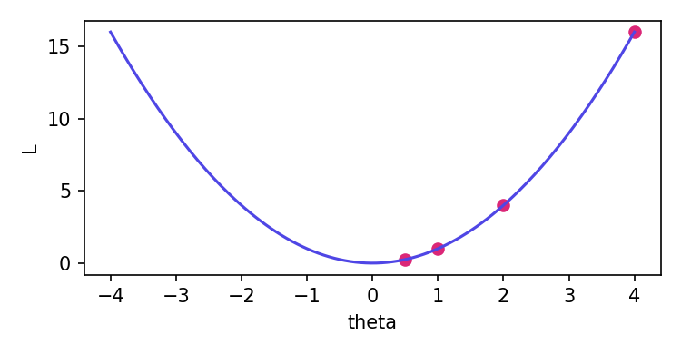

# Gradient Descent from First Principles

## Why optimisation matters

> [!OBJECTIVE]
> By the end of this chapter you will be able to:
> - derive the gradient descent update rule,
> - choose a sensible learning rate $\eta$,
> - read and write a minimal training loop.

Almost every modern learning system reduces to the same question: *which parameters make the loss small?* We write the loss as $L(\theta)$ and look for $\theta^\star = \arg\min_\theta L(\theta)$. Plain **bold** and `inline code` stay restrained, and [links](https://example.com) are coloured.

### The update rule

Starting from a point $\theta_t$, we step against the gradient:

$$\theta_{t+1} = \theta_t - \eta \, \nabla_\theta L(\theta_t)$$

Expanding the loss to first order gives the intuition:

$$
L(\theta + \delta) \approx L(\theta) + \nabla L(\theta)^\top \delta \\
\delta^\star = -\eta \nabla L(\theta)
$$

> [!DEFINITION] Learning rate
> The scalar $\eta > 0$ that scales each gradient step. Too small and training crawls; too large and it diverges.

> [!EXAMPLE] One step by hand
> Let $L(\theta) = \theta^2$ and $\theta_0 = 4$ with $\eta = 0.25$.
> The gradient is $2\theta_0 = 8$, so $\theta_1 = 4 - 0.25 \cdot 8 = 2$.

> [!INSIGHT]
> Each step shrinks $\theta$ by the factor $(1 - 2\eta)$, which explains why $\eta = 1$ oscillates forever.

> [!WARNING]
> A learning rate above $1$ makes this quadratic diverge.

## Implementation

```python title="Minimal training loop"
def train(theta, grad, lr=0.1, steps=100):
    history = []
    for step in range(steps):
        theta = theta - lr * grad(theta)  # one update
        history.append(theta)
    return theta, history

final, path = train(4.0, lambda t: 2 * t, lr=0.25, steps=10)
print(f"final value: {final:.6f}  after {len(path)} steps")
```

```bash
python train.py --lr 0.25 --steps 10
```

### Comparing learning rates

| Learning rate | Behaviour   | Steps to 1e-3 |
|:--------------|:-----------:|--------------:|
| 0.05          | slow        | 66            |
| 0.25          | good        | 11            |
| 0.90          | oscillates  | 70            |
| 1.10          | diverges    | never         |

Table: Effect of the learning rate on $L(\theta)=\theta^2$

- First bullet
  - nested bullet
  - another nested one
- Second bullet with `code`

1. Numbered one
2. Numbered two
3. Numbered three

> [!RECAP]
> The update rule is a single line; the art lies in picking $\eta$.

---

## Beyond the basics

Momentum keeps a running velocity $v_t = \beta v_{t-1} + \nabla L(\theta_t)$ and updates with $\theta_{t+1} = \theta_t - \eta v_t$. Adam additionally rescales by a running second moment.

> A plain blockquote is rendered as a quiet gray-indigo note without a label.



## Appendix

### Notation

Greek letters like α, β, γ and symbols such as ≤, ∑, → are routed to a fallback font automatically.
