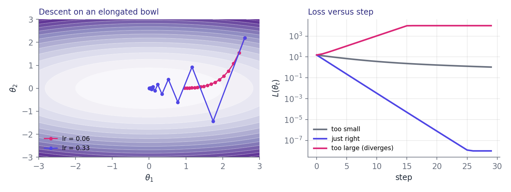

# The Optimization Coursebook

# Foundations

## Why this chapter exists

> [!OBJECTIVE]
> After this tour you will know how each Markdown construct becomes a page element:
> - **callout boxes** in a dozen semantic colors,
> - **equations** that look like they came from a paper,
> - **code listings** with highlighting, line numbers and captions,
> - **tables, figures and cross-chapter numbering** that stay consistent.

This document is the demo. Every box, equation, table and listing below is ordinary Markdown, converted offline with one command. Headings become numbered chapters and sections, the contents page builds itself, and every heading is a clickable PDF bookmark.

Inline formatting stays restrained: **bold** for emphasis, *italics* for terms, `inline code` in a warm accent, [links](https://github.com/MikeDegany/md2textbook) in indigo, and math such as $f(x) = \sigma(w^\top x + b)$ set in a serif italic that matches the body.

### The problem in one line

Learning means choosing parameters $\theta \in \mathbb{R}^d$ that make a loss small:

$$\theta^\star = \arg\min_{\theta} \; L(\theta), \qquad L(\theta) = \frac{1}{N} \sum_{i=1}^{N} \ell\big(f_\theta(x_i),\, y_i\big)$$

> [!DEFINITION] Gradient
> The vector $\nabla L(\theta) = \left( \frac{\partial L}{\partial \theta_1}, \dots, \frac{\partial L}{\partial \theta_d} \right)$ of partial derivatives. It points in the direction of steepest *increase* of $L$.

> [!EXAMPLE] A worked step
> Take $L(\theta) = \theta^2$, start at $\theta_0 = 4$ and use a learning rate $\eta = 0.25$.
> The gradient is $2\theta_0 = 8$, so $\theta_1 = 4 - 0.25 \cdot 8 = 2$.
> One more step gives $\theta_2 = 2 - 0.25 \cdot 4 = 1$: the value halves every time.

> [!INSIGHT] Why halving?
> Each update multiplies $\theta$ by $(1 - 2\eta)$. For $\eta = 0.25$ that factor is $0.5$, so convergence is geometric. At $\eta = 1$ the factor is $-1$ and the iterate bounces between two values forever.

> [!WARNING]
> For this quadratic, any $\eta > 1$ makes the factor $|1 - 2\eta| > 1$ and the iteration **diverges**.

## The update rule

### Gradient descent

Starting from $\theta_0$, repeat

$$\theta_{t+1} = \theta_t - \eta \, \nabla L(\theta_t)$$

Why does stepping against the gradient help? A first-order expansion shows the loss change for a small step $\delta$:

$$
L(\theta + \delta) \approx L(\theta) + \nabla L(\theta)^\top \delta \\
\delta^\star = -\eta \, \nabla L(\theta) \\
L(\theta + \delta^\star) \approx L(\theta) - \eta \, \lVert \nabla L(\theta) \rVert^2
$$

Equations are numbered per chapter, like (1.1) and (1.2), so you can refer to them from the text.

### Momentum and Adam

Momentum accumulates a velocity $v_t = \beta v_{t-1} + \nabla L(\theta_t)$. Adam also tracks a second moment and divides by its square root:

$$\theta_{t+1} = \theta_t - \eta \, \frac{\hat{m}_t}{\sqrt{\hat{v}_t} + \epsilon}$$

> [!THEOREM] Convergence on convex quadratics
> If $L(\theta) = \tfrac{1}{2}\theta^\top A \theta$ with eigenvalues in $[\mu, L_{\max}]$, gradient descent with $\eta = \frac{2}{\mu + L_{\max}}$ satisfies
> $$\lVert \theta_t - \theta^\star \rVert \le \left( \frac{\kappa - 1}{\kappa + 1} \right)^{t} \lVert \theta_0 - \theta^\star \rVert, \qquad \kappa = \frac{L_{\max}}{\mu}.$$

> [!TIP]
> Plot the loss on a log axis. Straight lines mean geometric convergence; a flat tail means you have hit the noise floor.

# Code and Data

## Listings

Fenced code is highlighted with an editor-style dark theme. Add `title="..."` to get a numbered caption, and long lines wrap with a continuation arrow instead of shrinking.

```python title="Gradient descent with momentum"
import numpy as np


def descend(grad, theta0, lr=0.1, beta=0.9, steps=200):
    """Minimise a function given its gradient."""
    theta, velocity = np.asarray(theta0, dtype=float), 0.0
    history = [theta.copy()]
    for step in range(steps):
        velocity = beta * velocity + grad(theta)
        theta = theta - lr * velocity  # one update
        history.append(theta.copy())
    return theta, np.array(history)


theta, path = descend(lambda t: np.array([1.0, 5.0]) * t, [2.6, 2.2], lr=0.05)
print(f"final point: {theta}  after {len(path) - 1} steps")
```

Other languages work the same way:

```rust title="The same update in Rust"
fn step(theta: &mut [f64], grad: &[f64], lr: f64) {
    for (t, g) in theta.iter_mut().zip(grad) {
        *t -= lr * g;
    }
}
```

```yaml title="A training configuration"
optimizer:
  name: adam
  lr: 3.0e-4
  betas: [0.9, 0.999]
schedule:
  type: cosine
  warmup_steps: 500
```

Shell snippets are shown without line numbers:

```bash
pipx install md2textbook
md2textbook showcase.md --no-open
```

## Tables

Pipe tables get a dark header, zebra rows, alignment from the separator row, and a repeating header if they run onto another page.

| Optimizer | Memory | Typical learning rate | Notes |
|:----------|:------:|----------------------:|:------|
| SGD | $O(d)$ | 0.1 | Simple and strong with a good schedule |
| SGD + momentum | $O(d)$ | 0.05 | Smooths noisy gradients |
| Adam | $O(2d)$ | 0.0003 | Default for transformers; needs warmup |
| L-BFGS | $O(md)$ | 1.0 | Full batch only; great for small problems |

Table: Common optimizers compared

## Lists

- Bullets nest to any depth
  - second level
    - third level
- Task lists are drawn as check boxes:
  - [x] write the Markdown
  - [x] run `md2textbook`
  - [ ] enjoy the PDF

1. Numbered lists keep their numbering
2. including nested items
   1. like this one
   2. and this one
3. and carry on afterwards

> [!BRIEF] Cheat sheet
> - Start a box with `> [!KIND]` or `> **Kind:**`
> - Kinds include DEFINITION, EXAMPLE, INSIGHT, WARNING, RECAP, OBJECTIVE, CODE, IDEA, REVIEW, BRIEF, MATH and NOTE
> - Equations: `$inline$` and `$$display$$`
> - Code: add `title="..."` for a captioned listing

# Figures and Boxes

## Figures

Images keep their aspect ratio, never overflow the page, and get a numbered caption taken from the alt text.



## The full set of boxes

> [!NOTE]
> A note: neutral background information that is useful but not essential.

> [!CODE] Implementation hint
> Keep the learning-rate schedule in one function so experiments only change a single line.

> [!IDEA] Research idea
> Adapt $\eta$ per layer from the ratio of weight norm to gradient norm, and test whether it removes the need for warmup.

> [!REVIEW] Reviewer's view
> The convergence claim holds only for convex quadratics. The text should say what changes for non-convex losses.

> [!MATH] Derivation
> Setting the derivative of $L(\theta + \delta) = L(\theta) + g^\top \delta + \frac{1}{2\eta} \lVert \delta \rVert^2$ to zero gives $\delta = -\eta g$, the gradient step.

> [!RECAP] Key takeaways
> - The update rule is one line: $\theta_{t+1} = \theta_t - \eta \nabla L(\theta_t)$.
> - The learning rate decides everything: too small is slow, too large diverges.
> - Momentum and Adam help when curvature differs across directions.

---

A plain blockquote becomes a quiet, unlabeled note:

> "The art of being wise is the art of knowing what to overlook." *William James*

Unicode works without ceremony: α, β, γ, ∇, ∑, ≤, ≈, → and ✓ are routed to a font that has them.
